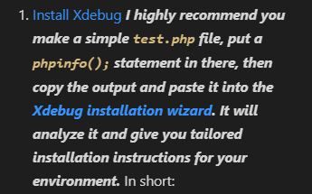
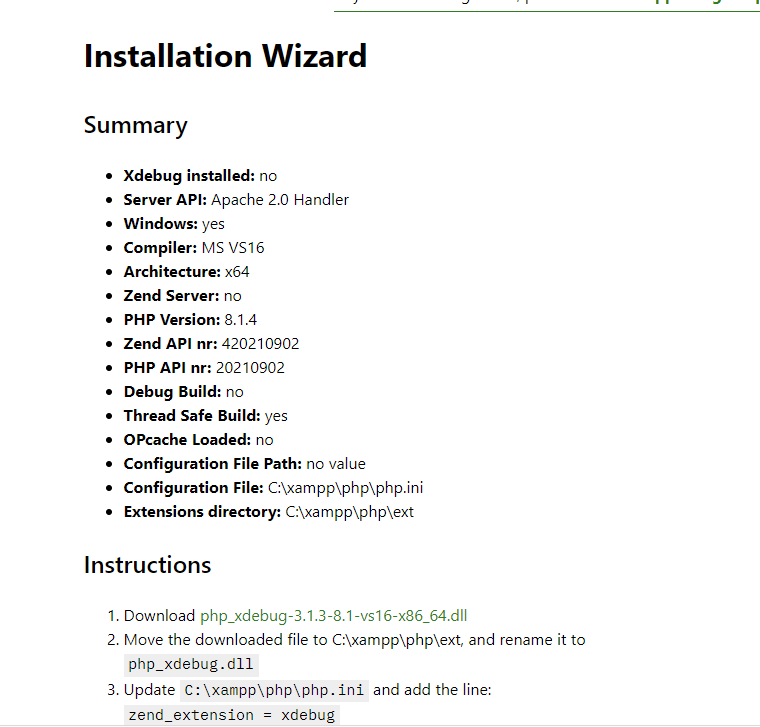

# Xdebug-en-VSCODE
Guía de instalación de Xdebug en VSCODE

# Índice #

- ## Software de esta instalación ##

- ## VS Code - PHP Debug ##

- ## Xdebug ##

- ## VS Code - launch.json ##

- ## Xdebug en acción ##

**Software de esta instalación**

El Software que utilize para la guía es:
  - VSCODE 1.65
  - Xdebug
  - xampp 3.2.24

**VS Code - PHP Debug**

Abrimos VSCODE, vamos a la pestaña extensiones, y buscamos lo siguiente:

Instalamos la aplicación

Luego iremos a detalles de esa extensión y seleccionamos el enlace para ir xdebug

Nos dirigira a esta pagina

**Xdebug**

A continuación vamos a xampp->phpinfo

seleccionamos todo el contenido de la página(ctrl+a) y lo copiamos

En la página de xdebug, vamos a pegar la informacion de phpinfo

Pulsamos el boton analizar phpinfo(), y nos mostrara la informacion de nuestros servicios y las intrucciones para configurarlo

Ahora solo es seguir las instrucciones, primeramente seleccionamos el enlace de la primera opcion para descargar xdebug

Luego vamos a esta direccion C:\xampp\php\ext y pegamos el archivo descargado en esa carpeta

Luego paramos el servicio de apache en xampp

Ahora en el panel de xampp iremos a la configuracion de apache

Posteriormente seleccionamos la opcion php.ini, donde se nos abrira el fichero

Copiamos la siguiente linea donde se encuentra la ruta en mi caso sera la siguiente

> zend_extension = C:\xampp\php\ext\php_xdebug-3.1.3-8.1-vs16-x86_64.dll

En la parte final del fichero pegamos la linea copiada y guardamos

Seguidamente para habilitar el debug remoto pegaremos en el fichero anterior tres lineas mas quedando el fichero así, y guardamos

**VS Code - launch.json**

Nos vamos a VSCODE, creamos un archivo en la carpeta htdocs de xampp

Ahora hacemos un pequeño programa de multiplicacion

Nos vamos a la opcion de run and Debug

Seleccionamos el icono de configuración

Nos aparecerá la siguiente ventana de configuración, donde copiaremos el siguiente contenido

Finalmente ya tenemos el debugger configurado.
